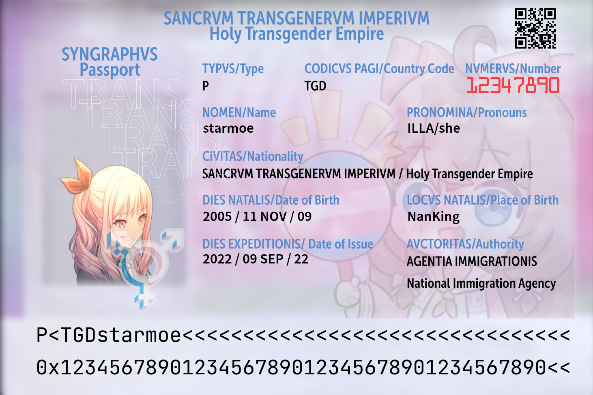

# 神圣跨性别帝国护照生成器




## 安装依赖
```bash
pip3 install pillow qrcode
```

## 生成属于您的护照
```bash
python3 main.py
```

您的护照将会保存在`out.png`中

## todo
+ ~~自定义头像~~ 您甚至可以直接更改`head.png`

## license
`main.py` 使用 MIT 协议

`*.ttf`, `*.otf` 归原作者管

`background.png`, `head.png`, `mask.png`, `EXAMPLE_STI.krz` 归原作者管

